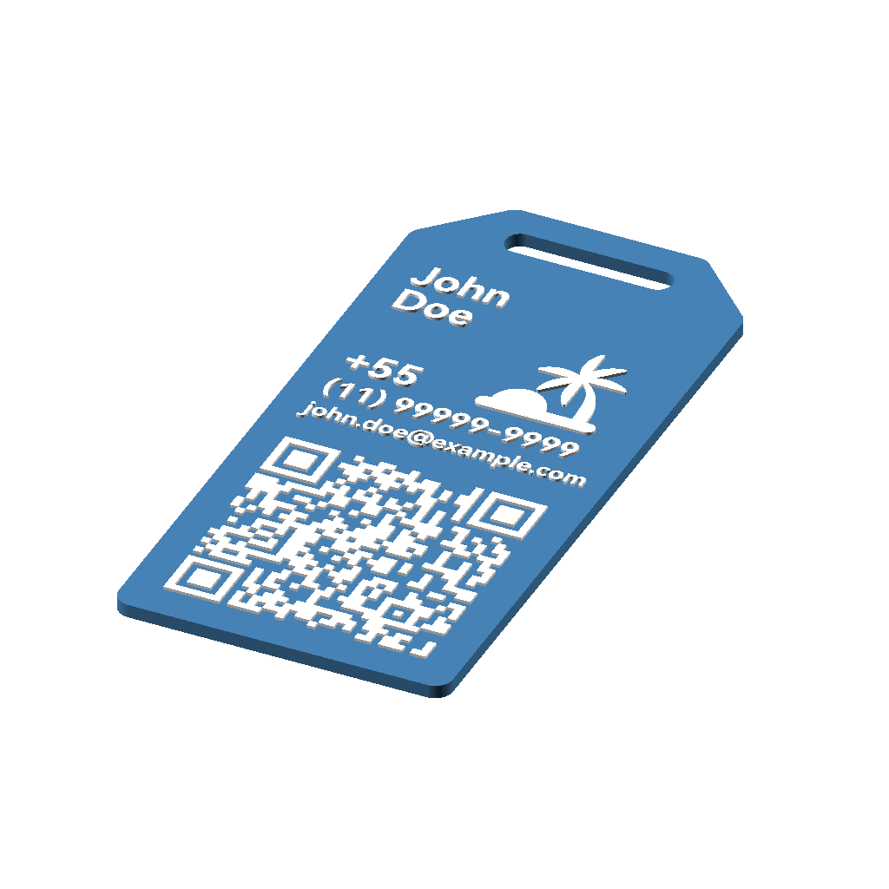
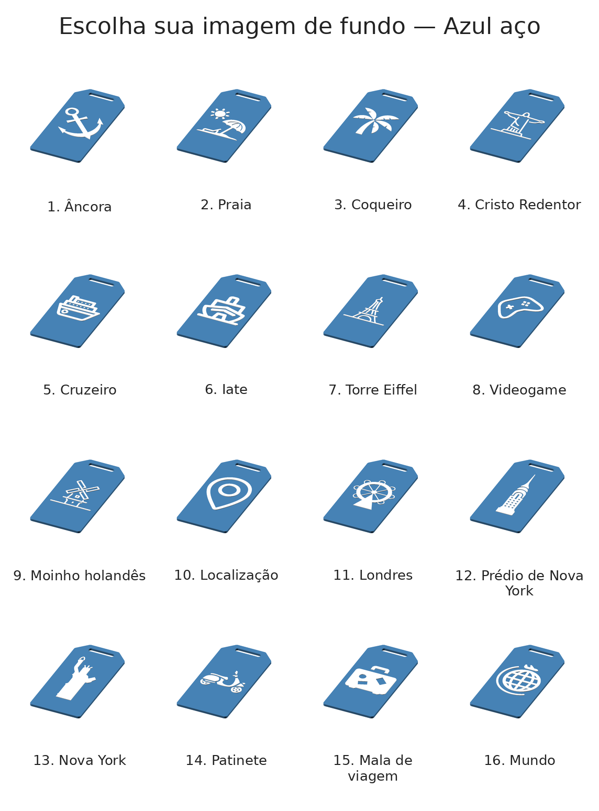
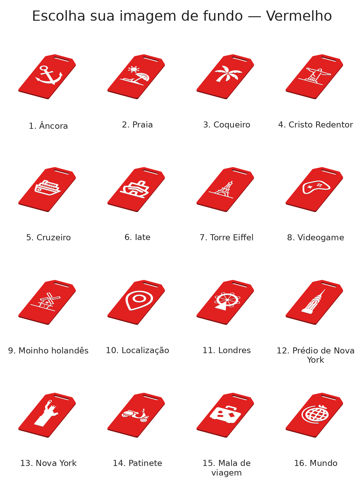
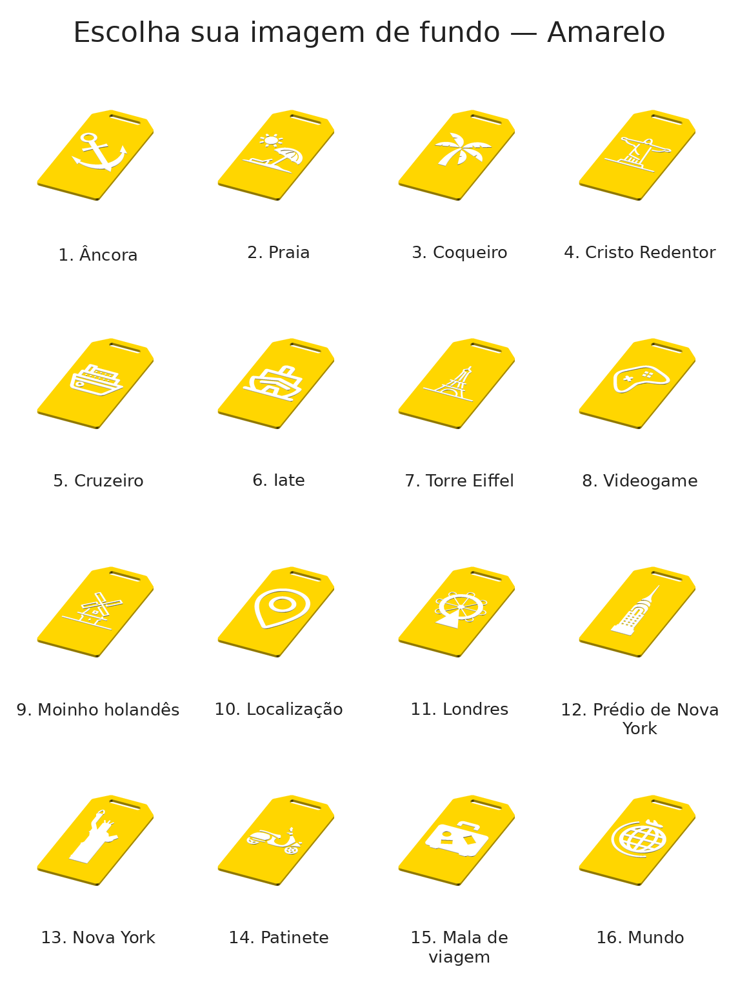

# SCAD Tag Generator

Generate an STL from the luggage-tag OpenSCAD template
([scripts/dados-tag.scad](scripts/dados-tag.scad)) driven by a YAML config. The
template is never modified — values are passed to OpenSCAD via `-D` overrides.

## Demo

The tag carries a name, derived phone lines, an email, a QR code and an icon —
all rendered into a single printable body. `generate-preview.py` produces
white-on-colour PNGs like these (from [configs/config-john-doe.yaml](configs/config-john-doe.yaml)):

| Info side | Icon side |
|-----------|-----------|
|  |  |

## Requirements

- Python 3.8+ with `pyyaml` (`pip install pyyaml`)
- [OpenSCAD](https://openscad.org/downloads.html) on your `PATH` (or set
  `openscad:` in the config to its binary path)

## Usage

```bash
python3 generate-tag.py configs/config.yaml
```

Two STLs are written: the full tag at `<output_dir>/<output_name>.stl`, and a
bare tag body (no text/QR/icon) at `<output_dir>/tag.stl` — the base that
`generate-preview.py` overlays coloured icons onto.

### Assembly (3MF)

To print the tag in multiple colours, assemble the separate STLs into a **single
3MF object made of three parts**, then assign a filament/colour to each part in
your slicer:

| Part | STL | Notes |
|------|-----|-------|
| Tag | `output/stl/tag.stl` | The bare body — its **exposure (height) is 2.3 mm** |
| Tag info | `output/stl/<output_name>-info.stl` | Name, phone, email and QR, raised on the front |
| Icon | `output/stl/icons/<icon>.stl` | The chosen icon, raised on the back |

All three share the same origin, so loading them together drops each part into
place. Combine them as parts of one object (not separate objects) so the slicer
treats the result as a single watertight model and the colours fuse on print.

### Chain

`output/stl/chain.stl` is a companion part: a flat, flexible printable strap
(~11 mm wide × 210 mm long × 2.1 mm thick) that threads through the tag's slot
and around a luggage handle to fasten the tag in place. It's a ready-made model
shipped with the project — it isn't generated by `generate-tag.py`, so print it
once and reuse it with any tag.

Print it in **TPU** (flexible filament) so it bends around the handle without
snapping; the rigid tag body itself prints fine in PLA/PETG.

OpenSCAD's progress is streamed live. **Rendering is slow** — the QR code is
computed inside OpenSCAD, so the export can take a couple of minutes on
OpenSCAD 2021.x (it is working, not frozen).

Renders are cached by template + config, so an unchanged tag is restored from
disk instead of re-rendered. Files *referenced* by the config (e.g. the icon
SVG) aren't part of the cache key, so pass `--no-cache` to force a fresh render
after editing one (`generate-preview.py` accepts it too):

```bash
python3 generate-tag.py configs/config.yaml --no-cache
```

### Icon

The template embeds an SVG icon. The script resolves the icon to an absolute
path automatically (the template's bare-filename import otherwise looks in the
wrong directory). Configure it with the `icon` field:

```yaml
icon: "travel-svgrepo-com.svg"   # looked up in icons/ (default)
# icon: "/path/to/custom.svg"    # or a direct path
# icon: false                    # disable the icon entirely
```

Any name without a directory is resolved against the `icons/` folder. Omitting
`icon` uses the bundled travel icon.

### Preview

`generate-preview.py` renders white-icon-on-coloured-tag PNGs. Run it with no
arguments to pick a mode from a console menu:

```bash
python3 generate-preview.py
```

- **Icons** — every icon (plus the info side from `configs/config.yaml`) on a
  coloured tag, one PNG per icon per colour. This is what `generate-catalog.py`
  consumes.
- **Tags** — pick one tag config from `configs/` (e.g.
  `config-john-doe`) and preview just its info side in a chosen
  colour.

PNGs are split by kind under `output/previews/`: icon previews in
`output/previews/icons/` and tag-name (info side) previews in
`output/previews/tags/`.

Both can be driven non-interactively:

```bash
python3 generate-preview.py --color red                                  # icons mode
python3 generate-preview.py --mode tags --tag-config config-john-doe --color red
```

### Catalog

`generate-catalog.py` tiles the per-icon previews (from `generate-preview.py`)
into one enumerated selection sheet per colour — a sheet a customer can browse
to pick an icon by number.

```bash
python3 generate-catalog.py                 # a catalog per colour with previews
python3 generate-catalog.py --color red     # just the red catalog
python3 generate-catalog.py --columns 5
```

A catalog looks like this (one sheet per colour — steel blue, red, yellow shown):

| | | |
|---|---|---|
|  |  |  |

Catalogs are written to `output/catalog/catalog-<colour>.png`. The header and
icon/colour labels are in **PT-BR** (e.g. "Escolha seu ícone — Amarelo");
translations live in `taggen/catalog.py` and fall back to the English name for
any icon or colour not listed. Numbering comes from a single alphabetical sort
of `icons/`, so icon #N is the same icon in every colour; an icon missing a
preview for some colour renders a placeholder cell so the numbering never
shifts. Requires Pillow and previews already rendered by `generate-preview.py`.

## Config

See [configs/config.yaml](configs/config.yaml) for a documented example. Tag
configs live in `configs/` (named `config*.yaml`); the *tags* preview mode lists
them by name. Key fields:

| Field | Purpose |
|-------|---------|
| `name` / `last-name` | First two text lines; auto-sized to fit (max 33), both sharing the longer one's size |
| `qr_action` | `Tx`, `URL`, `Wa`, `Te`, `Email`, `SMS`, `Call` |
| `phone_number` | Brazilian number; derives line 4 (`+CC`) and line 5 (`(DD) XXXXX-XXXX`) |
| `email` | Becomes text line 6 |
| `size_line_4/5/6` | Optional override for the derived-line sizes (the email auto-fits the QR width; the phone lines use the template defaults 33 / 25) |
| `extra` | Any raw SCAD variable override (applied last) |

`HIDE_TAG` defaults to `false` so the printable tag body is exported; override
it via `extra` if needed.

## Tests

```bash
python3 -m pytest
```

Tests cover phone derivation, variable mapping, config validation, command
building and CLI orchestration — none require OpenSCAD to be installed.
